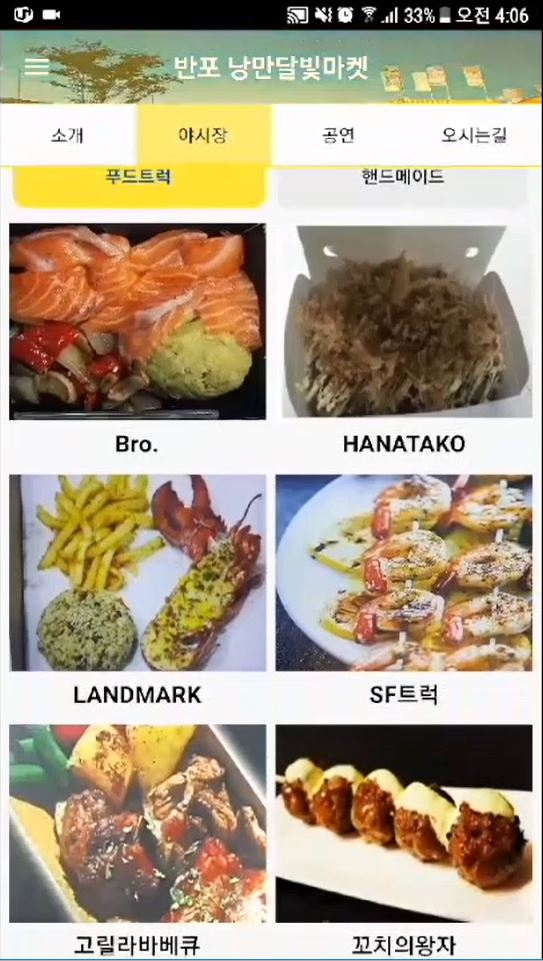
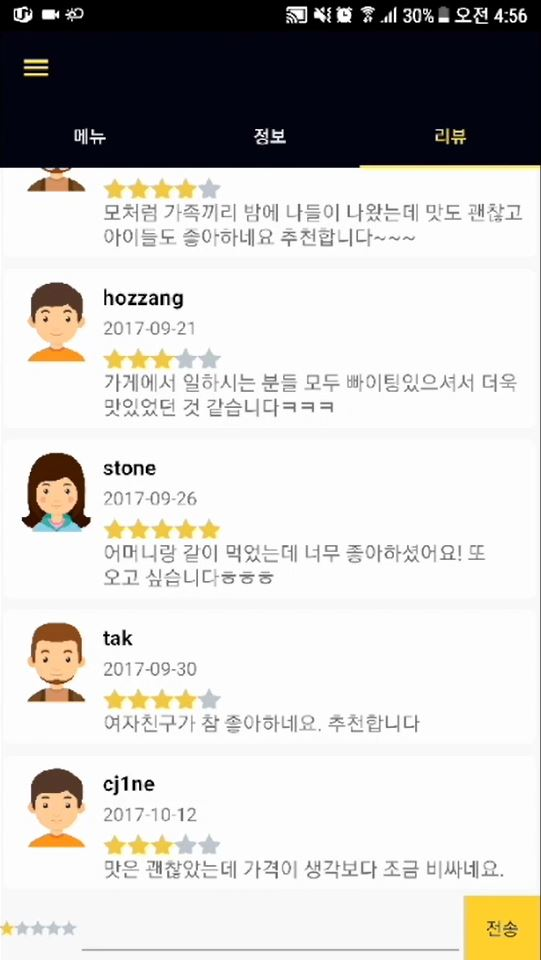
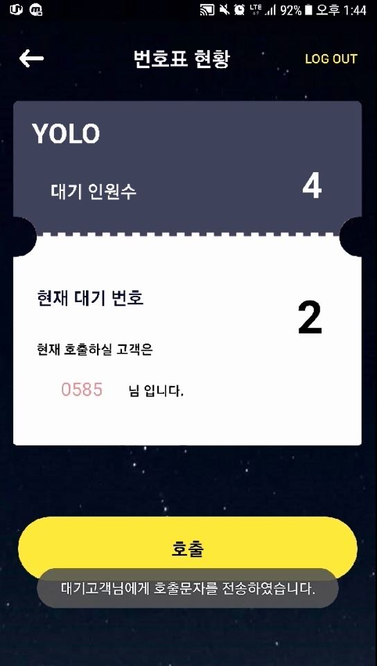
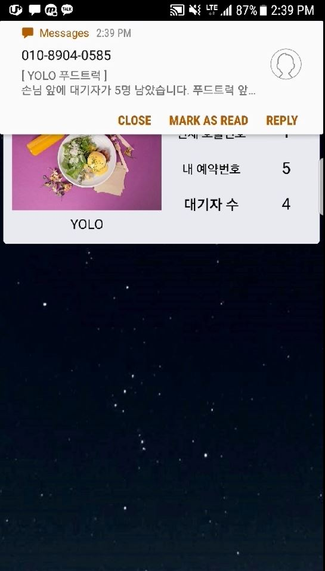

# SeoulNightMarket
### 2017년 서울시 앱 공모전 출품작 (도깨비夜)

### 1. 프로젝트 소개
- 서울 밤 도깨비 야시장 번호표 시스템

### 2. 기획 의도
- 2017년 밤도깨비야시장 방문자 수는 약 440만명
- 야시장 하루 평균 방문객은 약 10만명
- 푸드트럭 1대당 약 600명 대기 평균 대기시간 40~120분
- 줄서는 시간을 줄여서 야시장을 제대로 즐기게 하고 싶었습니다.

### 3. 주요 기능
> #### 1. 각 야시장별 푸드트럭 및 핸드메이드 정보 제공
> #### 2. 공연 일정 안내
> #### 3. 실시간 리뷰 남기기
> #### 4. 푸드트럭 번호표 발급 및 호출

### 4. 애플리케이션 이미지
   

### 5. 애플리케이션 시연 영상
[https://www.youtube.com/watch?v=Nl_rUSVCQkY](https://www.youtube.com/watch?v=Nl_rUSVCQkY)

### 6. 기대 효과
- 서울 밤 도깨비 야시장 방문자들이 푸드트럭 앞에서 불필요하게 오래 기다리는 시간을 대폭 줄일 수 있으며 실시간 리뷰를 통한 합리적인 소비가 가능할 것입니다.

### 7. 수상내역
- 2017 서울시 앱 공모전 으뜸상(1등) 서울특별시 시장상 수상
